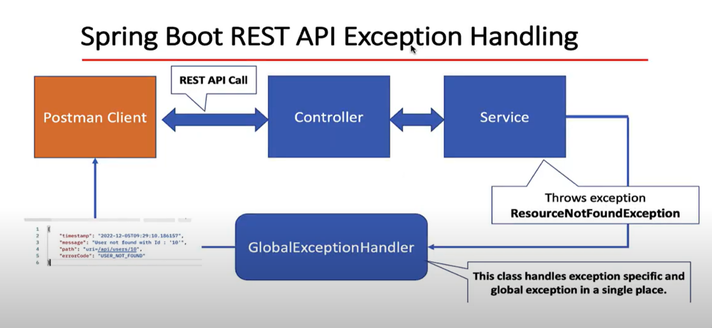

# Getting Started

### Spring Boot REST API Exception Handling



### Create and User Custom Exception
#### Requirement:

> If user does not exist with given id in the database then we need to throw exception with proper
> error message and status code.

```json
{
  "timestamp": "2024-05-21T17:12:59.055+00:00",
  "status": 404,
  "error": "Not Found",
  "path": "/api/v1/users/7/update"
}
```

### Development Steps

1. Create and user ResourceNotFoundException Custom Exception
2. Create ErrorDetails class to hold of the custom error response
3. Create GlobalExceptionHandler class to handle specific and global exception

1. Spring Boot REST API Exception Handling Overview
   spring-boot-rest-api-exception-handling